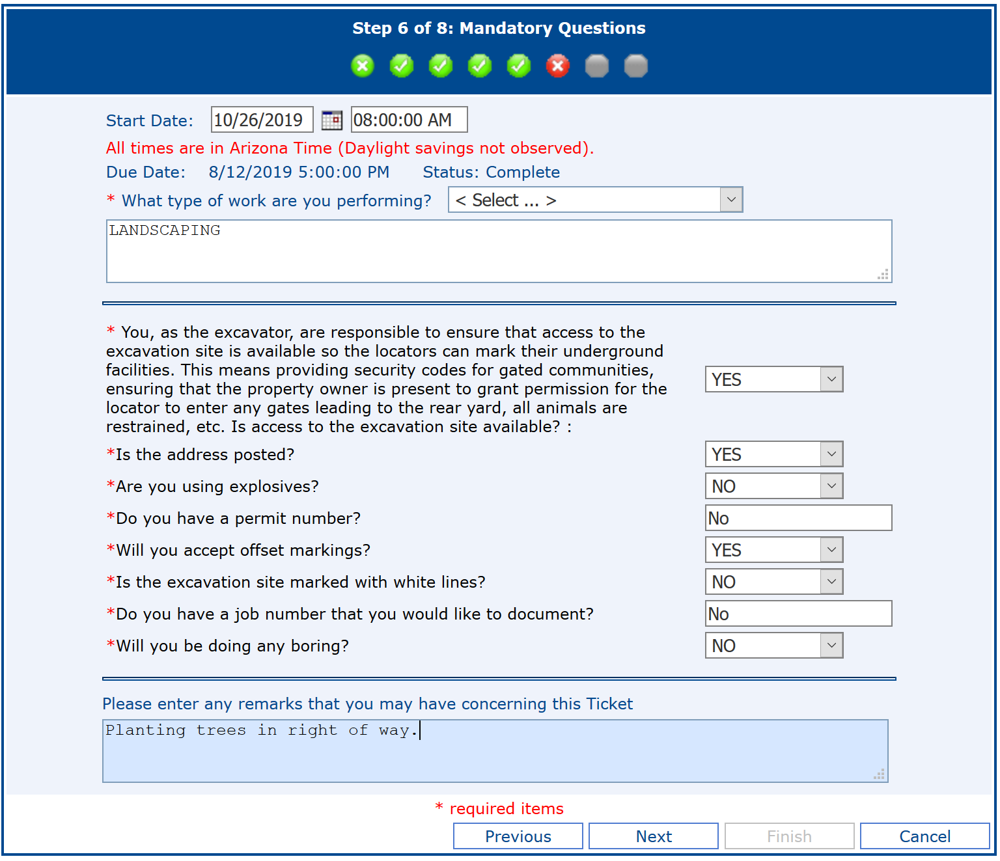

# How to Blue Stake

## What is Arizona 811 / Blue Stake

This is a free service where utilities come out and mark where their lines run.  You are required by Arizona law to do this on any project that involves digging (like planting trees!).

## How do I start?
Choose one of two easy options:
* CALL 811 Mon - Fri from 6 a.m. to 5 p.m.
* Create a ticket online at <http://www.azbluestake.com/>

Please wait to order a Blue Stake until October 14th - 21st!  If you order it too early it won't be valid by the planting date.

## What do I put on the form?
The online form does require you to have an email address.  You'll enter your address, where on the lot to put the trees (typically "Front of Lot").  Step 6 has a lot of fields, here's what was applicable to one of our homeowners (please verify the answers are right for you):

## What happens then?
According to Arizon 811:

> Underground facility locators will respond either by marking the location of their underground facilities in the corresponding color code or by issuing a "No Conflict" response. "No Conflict" means the facility operator does not own any underground facilities at your dig site. A "No Conflict" can be issued by phone or e-mail, or could be marked on site with an "N," a "No" or an "OK" next to the facility’s initials in the corresponding color for the specific utility (Examples: "N/APS," "No SRP," or "TEP OK").
