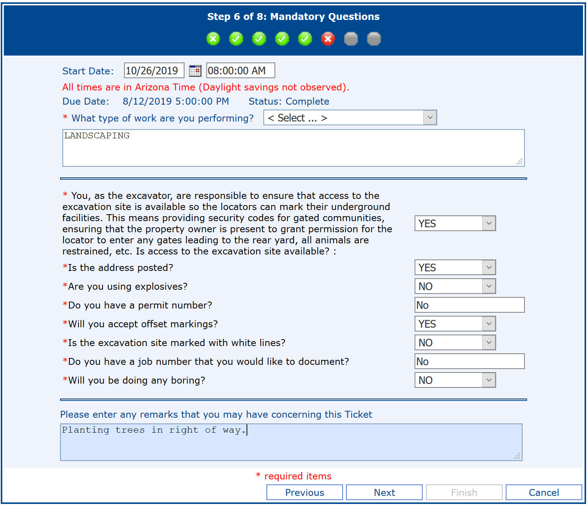

# Llame al 811 Antes de Excavar
<contact/>

## ¿Que es Arizona 811 / Blue Stake?

Este es un servicio gratis donde servicios públicos salen y marcan dónde corren sus líneas de utilidades (gas, electricidad, o agua). La ley de Arizona le exige que haga esto en cualquier proyecto que implique excavar (como plantar arboles!).

## ¿Como Empiezo?
Elige una de las dos opciones fáciles :
* Llama a 811 lunes a viernes de 6 a.m. a 5 p.m.
* Crear una solicitud por internet <http://www.azbluestake.com/>

 Por favor espera a llamar 811 hasta Octubre 14-21! Si llama mas temprano que Octubre 14 su solicitud no será válida para la fecha de plantar. 

## ¿Qué Pongo en el Formulario?
El formulario en línea requiere que tenga una dirección de correo electrónico. Escribirás su dirección de domicilio, en qué parte del lote quiere poner los árboles (típicamente "en frente del lote"). El paso 6 tiene muchas preguntas, esto es lo que era aplicable a uno de nuestros propietarios de casa (por favor verifique que las respuestas sean correctas para su propiedad):

## ¿Que Pasa Despues?
De acuerdo con Arizona 811:

Los localizadores de instalaciones subterráneas responderán marcando la ubicación de sus instalaciones subterráneas en el código de color correspondiente o emitiendo una respuesta de "No Conflict"/"No Conflicto". "No Conflicto" significa que la Compañia de Utilidades (agua, gas, o electricidad) no posee ninguna instalación subterránea en su sitio de excavación. Un "No Conflicto" puede darse por teléfono o correo electrónico, o puede marcarse en el sitio con un "N," un "No" o un "OK" junto a las iniciales de la instalación en el color correspondiente para la utilidad específica (Ejemplos: "N/APS," "No SRP," or "TEP OK").

<Footer/>